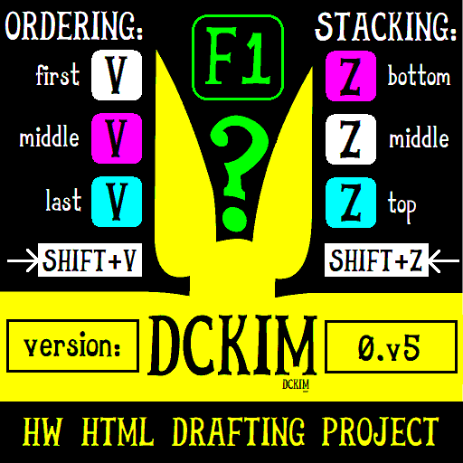
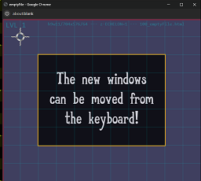
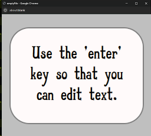
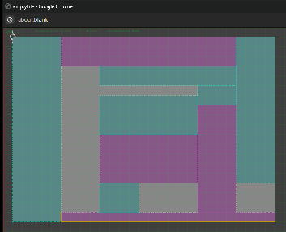
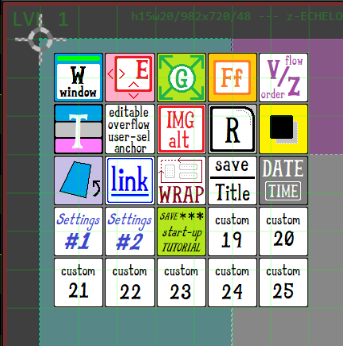
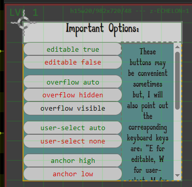
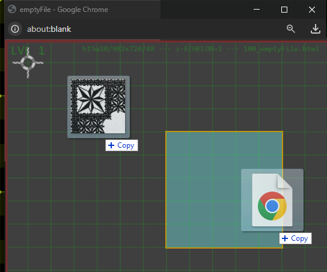

# HW HTML Drafting Project

__Open-Source All The Way!__

[DEMO at DCKIM.com](https://dckim.com/HW_project_online.html)

*HW HTML Drafting Project LOGO*

For the developers out there: The project is arranged conveniently for BASH with 'a_' letters to take advantage of 'tab-autocompletion'. This should sweeten the deal for potential contributors.

## Menu
- [Screen Grab HYPE](#screen-grab-hype)
- [Project Direction Notes](#project-direction-notes)
- [More Information for Developers](#more-information-for-developers) (or just anyone looking for a fun project)

## Screen Grab HYPE

[return to menu](#menu)

*The windows can be moved from the keyboard!*

*The 'enter' key basically gives you a 'what you see is what you can get' view. It is reversed by pressing the 'escape' key.*

*Make a Unnecessarily Complex Design. (why not?)*

*Unwrap the wizards to make your own unique toolbar.*

*Access important options throught the clickable interface. Or, if you are a pro on the keyboard, all the better!*

*Drag Image files, audio files, and video files directly into place. (text and HTML too!)*

The list of features goes on, and it's actually very easy to do the coding for your own new features. The only trick to write all of the JavaScript code in-line and inside of the button or input thingy. So, it's basically a universal way of bringing HTML into your daily computering tasks. For a personal website, this is basically the best you can get for a 'do-it-yourself'.

That way you stay in complete control over your own self-expression. It may be a little extra work designing your own webpage templates but, just think! They are completely re-useable!

## Project Direction Notes

[return to menu](#menu)

The foundational components of this project are in place and now, the next steps will be to decide on branches that are distinct but, thoughtfully developed.

The subject of HTML and it's usages are intentionally broad, and I believe that its value should naturally extend to daily use for non-experts. If only there was a facilitation in that direction.

The present project foundation is extensive, and has been left open for possibilities, and to accomodate the widest range of potential use cases.

I will endeavour to offer a description here.

The basic selection and focus system is completely integrated with a tripartite selection system based on what group the currently focused item is part of. Each item is a member of one and only one group. This allows functions to be applied more broadly, extending to groups.

A fairly obvious inclusion in the program is that dragging files in from the file system is allowed. This is not particularly interesting or unique.

What is more interesting and unique is the system in place which allows 'textually dragging' style or other attribute information from one part onto another, thus effecting the application of that information to the receptor. This feels like a very strong general foundation for a templating system. Each part can become a template via a selection of any of it's information. The example of a size and location template is fairly easy to see the advantages of, though other combinations may be as valuable but less obvious.

The way forward for the project as a whole is fairly clear: Potential branches must be considered carefully. The foundation of the project will be improved in a manner informed by hypothetical potential branches. Considerations will be made in a 'back-and-forth' manner until the optimal branch selections are made clear. At the appropriate and correct time, the foundation must be clarified and solidified in preparation for accomodating the branch candidates.

A common general set will be identified, and perhaps this initial foundation will be expanded or restricted thoughtfully allowing a clean separation, with overlap handled in the foundation. The foundation will represent the overlap of all branches.

In the earliest stage of branch design, the most crucial decisions are made, and can have a lasting effect on the project goind forward.

Even a decision being as simple as the number of branches could be crucial.

Too many will result in 'over-specialization'.

I could see between three to five being reasonable. 

- dckimGUY

## More Information for Developers

[return to menu](#menu)

For the developers out there, I hope there will be some attention here, and I can tell you that the project is set up in a pretty nifty way. That should help to make it easy to just pick up and take it in your own direction. There shouldn't be too much trouble for you to just write up your own code, which you are basically doing anyways.

Just take some of that knowledge and then bring it into a totally obvious visual environment.

For information, and to promote this project a bit further: I can tell you that almost all of the files inside of the project directories are organized with the BASH prompt in mind. So, they all start with an alphabet letter, and then have an underscore. So, when you are working with your own clone of the project, you will get the following result:
1. You will find the files neatly arranged: "/a_directory/b_directory/h_filename.js". Trust me this saves time and improves efficiency. For example, you can just use 'vi a *tab* b *tab* h *tab* enter'. (anyone who's been at this game a while will love that)
2. There is a very easy BASH script solution that will build the 'HW_project_online.html' file again from what is in the 'hw' directory. You can just type '. ./chalk' from the prompt, and it assembles the vital project components again. So, you can basically add '.js' files into the 'hw/a_programFunctions' directory at will, and as long as the file has a function inside of it with the same name as the filename (excluding the 'a_') then you are good to go. If you are familiar with BASH, just have a quick look inside of the 'chalk' file so that you can see what it will affect.
3. There are other convenient BASH scripts, basically ready to be used (as-is). If you just point your browser at the 'WEBSITE' directory, and start saving the browser downloads there, then you are set up pretty good for small-time website production. We just don't have any 'server-side' code happening. This project doesn't deal with any of that. It just deals with what can be easily understood, without any installs, and without any major programming knowledge. Basically 'regular-people-stuff'. That said, everyone can potentially benefit from opening up HTML for general daily use.
4. The JavaScript (in the 'hw' directory): It's mostly broken down into a 'one-function-one-file' type scenario. So, it's pretty easy to find functions and handle them.
5. It's even easier to find functions in the project by using the 'HW_treeDiagram.html' file. You can open that in the browser and then use 'ctrl+f' to find things.
6. Even as an organizational or communication type solution, this program has it covered. Extensibility is to the 9s on this one.

I hope that you have a look for yourself, and then give it a go.

Open-Source all the way!

-dckimGUY
