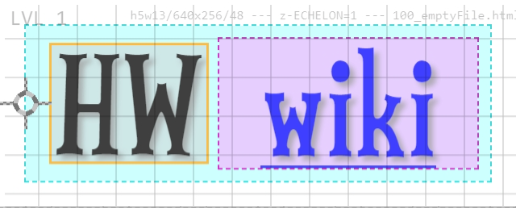
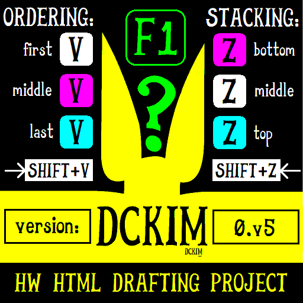

# [OPEN THE PROGRAM HERE](https://dckimguy.github.io/HW-HTML-Drafting-Project/)

April 23rd, 2026:

Wow, almost all of the documentation and 'helpful' stuff that I wrote has quickly become outdated. Most of it doesn't really apply anymore, and the best source of information is the keymap found on the F1 key in the program. Even the YouTube videos are not fully accurate anymore. I changed the 'RU' to being 'RW' for example. If you didn't know what it was before, I suppose that doesn't matter.

I really should try my best to spruce up the documentation and give some explanation of the potential usages for the various program components. The more I worked on the keybindings, the tighter knit the interactions between the available functions became. Hopefully you will agree with my selections there.

Choosing the final program components has been fairly straight forward, having done all of the programming up front. It's like choosing from a buffet dinner if you do it that way.

Following the optimization stage, I broke a lot of things. Most things weren't immediately obvious. Patching and reversion has caught most of the flailing code.

I'd like to throw in some more 'goodies', and pre-prep for the defaults though, I am sure that you will come up with better arrangements than I will.

Most of what follows here, and especially anything found at dckim.org is very much out of date, but, I have left it on there for now. You can get a bit of a peek back in time, and see where the project has come from, before reaching it's current stage. There were even some trades-level gawkers poking fun in some mastodon 'ribbing'. They seemed to all believe that the project was at the 'fully-complete' stage, and did not understand the actual development process which was happening. I found that to be quite amusing, and must admit that I deliberately 'played it up'.

'Well, why would you put everything on the key? And why would you use the CAPS lock as a mode?'

How else would I test everything from scratch with no IDE to speak of? So, it became an improptu IDE of itself. It's very curious how the program somehow solved it's own quandaries as it snowballed along the path. I worked just enough in the back end to get the advertisement system happening. Clearly the way forward is in the back end codework. That's pretty obvious now that the front end code has become all but played out.

My preference has been to keep the work on the user's machine as far as possible. That way, if it is a matter of keeping the outfile as a single file, then it's good. If the user wishes to upload somewhere, all the same. Maybe better to break it up with minimal sources at that point. Certainly though, it must remain as a choice.

Clearly, if there is a back end integration suited, it should not overwhelm the process, or eliminate any beneficial selections in the outcomes. I am not entirely familiar with the common practice as relates to the back end but, I assume that I have already reduced the parts to a condition which is nearly ready for the transfer.

I think I'll leave this old stuff in here for now:

# HW HTML Drafting Project

#dckimGUY

__Open-Source All The Way!__

This wiki is old, and the information is not relevant anymore...

[Visit DCKIM.com](https://dckim.com/)

Here is some other information so that you know that the project has some real traction. It seems that an actual company in the United States has made some sort of assessment of the project, which was conducted in an online forum. A little bit unprofessional, but, we'll take whatever free press we can get.

The interest seems to be related to 'legal sourcing':
https://mastodon.social/@glyph/115452884322460847
https://mastodon.social/@glyph/115452658138339709

DCKIM HTML Drafting Project is advertised on Mastodon.Social since the beginning of October 2025 on 4 hour intervals and in more than 40 different languages with matched pages in-language with individual RSS feeds in-language, all with alternate-language tags for both RSS and pages. It has been thoroughly done, and this has helped to approach the goal of global HTML Drafting Domination (muhahahaha). The advertisements have been online at mastodon, and in physical locations in the City of North York with signage on the community sign-posting boards(large signs).

Then here's the top linking sites for DCKIM, it's long, and that helps with brand-authority and visibility:

As of 2026-01-23:

Site,Linking pages,Target pages
mastodon.social,29,6
hli.fi,8,3
fabrykajabo.li,7,1
murkworks.net,7,2
rando.social,6,4
draconity.me,5,1
github.com,5,1
loud.computer,5,1
pandapla.net,5,1
silicon.moe,5,1
techtett.de,5,1
esgeroth.org,4,2
persadon.com,4,1
phantanews.de,4,1
ruiguimaraes.net,4,1
schleswig-holstein.de,4,3
anothersuper.social,3,1
bsky.app,3,3
metikumity.com,3,1
nighten.fr,3,1
nwt.social,3,2
oslo.town,3,1
uninformation.org,3,1
uvix.cc,3,1
yumk.xyz,3,1
ecoevo.social,2,1
heads.social,2,1
indiefilmmakers.social,2,1
linux.it,2,1
losno.co,2,1
mastodon.nu,2,2
meowstodon.eu,2,1
nfdi.social,2,1
resolutions.it,2,1
return12.net,2,1
sieprawski.pl,2,1
someplace.social,2,1
suomi.social,2,1
yelvington.com,2,1
2137.social,1,1
academiccloud.social,1,1
aleph.land,1,1
avision-it.social,1,1
birdbox.party,1,1
canadiancivil.com,1,1
critter.cafe,1,1
danq.me,1,1
digitalcourage.social,1,1
evy.pet,1,1
fedia.social,1,1
fedica.com,1,1
freefree.ps,1,1
freesewing.social,1,1
fromm.social,1,1
gamedev.berlin,1,1
gamedev.place,1,1
ganyuss.com,1,1
hachyderm.io,1,1
hams.social,1,1
infosec.exchange,1,1
jmrp.io,1,1
juuze.de,1,1
kompektiva.org,1,1
makearmy.io,1,1
mastodns.net,1,1
minidisc.tokyo,1,1
mstdn-social.com,1,1
mstdn.games,1,1
mstdn.social,1,1
mytech.nexus,1,1
neocities.org,1,1
neverhill.social,1,1
notpickard.com,1,1
ohai.social,1,1
osumiakari.jp,1,1
peaceful.social,1,1
pepicrft.me,1,1
photorat.org,1,1
podcasts.social,1,1
publicgood.social,1,1
sadmin.io,1,1
securitycafe.ca,1,1
shuttle.eu,1,1
snabelen.no,1,1
stefanbohacek.online,1,1
thebristolcable.social,1,1
tweesecake.social,1,1
urbanists.social,1,1
uwa4d.com,1,1
wake.st,1,1
wildserver.ru,1,1
witter.cz,1,1

(That's just some of them, there are more in there, and more coming because advertisement continues until present. It's automated.)