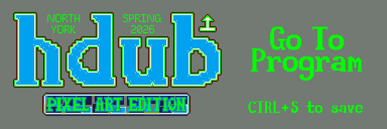
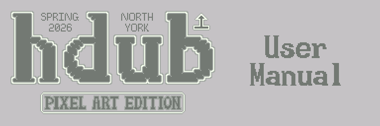

# HDUB Pixel Art Edition

This project is a non-corporate initiative which does not cost money, does not track you, and does not contain advertisement. The software is actually very simple and works entirely within in any web browser. There is no need to download or set up any additional software to make the program work. There are no external dependencies. HDUB Pixel Art Edition is totally free to use, forever.

## Save the program using ctrl + s

The following is a link where you can open the program immediately in your web browser. The next link goes to the documentation which will help you to get started using the program. Down below there is a description given which tells all about the program, and what intense capability it has.

## Here is a program description.

This project started as one man's learning project, aiming to learn and use javascript. After working through some early small programs, this last iteration has exceeded all expectations, and has even become a very real and useful program.

HDUB Pixel Art Edition is a very capable graphical editor designed and developed specifically for HTML. It is nearly a 'what you see is what you get editor' but, the finished view can be easily toggled, so we still have some helpful construction and information overlays available full-time. The documentation available at dckim.org gives buttons descriptions, etc, and they will not be repeated here.

The program features a standardized way of producing simple graphical buttons with custom text and colours. In addition to that, there is also a method given which allows the user to design completely custom HTML buttons, with the various states arranged in single image files, a lot like sprite sheets. Associated with that is a custom process which is easy to understand and implement. The process is give on the YouTube channel for this project. All of the custom button graphics are de-duplicated and amalgamated into a single sheet, just like a standard image atlas, when the file is saved as either a single vanilla HTML, with no dependencies, or the file is saved in a zip, with images etc sourced automatically.

## Image atlas explained in depth.

To give some insight into the de-duplication process and the anatomy of the image atlas that is produced: Imagery is de-duplicated, this means that the outgoing file(s) will contain only one reference to any image, and that will be contained in the single image atlas. The outgoing file setup will be very fast because of this setup. We have only one image atlas file, and each image in the page is a reference to a specific location on that atlas. The atlas itself if arranged in such a way that the image atlas in no larger that 4096 by 4096, and when this size is exceeded, another least power of two square atlas becomes the overflow, again not exceeding that maximum memory allotment size. The threshold was chosen to align with the typical memory maximum for mobile phones.

## Audio behaviour explained.

As a sidenote, audio files are treated in an interesting way. When an audio file is dragged from the filesystem on top of a custom button, that custom button will then play the audio when clicked. This is the default behaviour, which makes it very easy to 'key-up' some cool sound-effects for you webpages/programs/games.

## Special syntax input to define HTML rectangles.

Rectangles can be defined in a simple row/height syntax in the form: h12w6w12w8h4w6w6w4... where the letter 'h' begins the new row at a new height. The 'w' begins a new column within the row at the given width. This is a tightly packed syntax, which doesn't skip any spaces. Additionally there is another syntax which can be overlayed on top of this simple row/height description, and it will give a reference to HTML components which can be designated for that rectangular space within the description. In addtion the row/height syntax can be exported to a file which is a simple '.png' image of the layout. That file is then a shape-key for the HTML layout, and has the row/height syntax making up part of a special filename structure. The advantage to this is that many many HTML layouts can be saved as simple shape keys, and so we can build an extensive repertoire within the native file system. Because the shape-keys are '.png' we can visually see what the layouts are in the file system as 'in-system' rendered thumbnails are common for '.png'. The syntax and associated systems for using it, are built with 'blazing fast' speed in mind. It is unlikely that the user will need a faster method for inputting layout keys, and the integration with the native filing system is a real plus, allowing the user to organize their layout key however they see fit. Instead of the program becoming a completely dominating manager, it serves well with a partial 'convenience-level' manager, as there is a very capable method of lining up 24 layouts within the program context.

This level of layout management will seldom be necessary for the hobbyist. This is far more than any ordinary user would expect to require but, at the same time it remains very simple to use.

## It's getting late, and I'm tired, so maybe I will keep updating this readme file another day...

## Here are some links where some tech people linked/boosted this project:

[https://mastodon.social/@glyph/115452884322460847](https://mastodon.social/@glyph/115452884322460847)

[https://mastodon.social/@glyph/115452658138339709](https://mastodon.social/@glyph/115452658138339709)